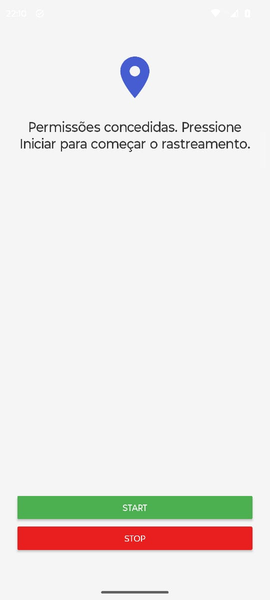

# Locator

**Locator** é uma aplicação Android desenvolvida em Kotlin que permite o rastreamento da localização do utilizador em tempo real. A aplicação inclui um sistema de autenticação e um serviço de fundo (foreground service) que captura as coordenadas geográficas (latitude e longitude) e as envia periodicamente para uma API remota.

<p align="center">
    
</p>

## 📋 Funcionalidades

- **Autenticação de Utilizador:** Ecrã de login para autenticação segura junto da API.
- **Rastreamento em Segundo Plano:** Utiliza um _Foreground Service_ para garantir que a localização continua a ser enviada mesmo quando a aplicação não está visível.
- **Controlo Manual:** Interface simples para **Iniciar** e **Parar** o envio de localização.
- **Gestão de Permissões:** Solicita permissões de localização precisa e de fundo conforme necessário pelas versões mais recentes do Android (incluindo Android 10+).
- **Integração com API REST:** Envio de dados via JSON para um servidor remoto utilizando Retrofit.

## 🛠️ Tecnologias Utilizadas

- **Linguagem:** [Kotlin](https://kotlinlang.org/)
- **Arquitetura:** MVVM (parcialmente implementada com separação de serviços e gestão de API).
- **Interface (UI):** XML Layouts com Material Design 3.
- **Conectividade:**
- [Retrofit 2](https://square.github.io/retrofit/) para chamadas HTTP.
- [Gson](https://github.com/google/gson) para conversão de JSON.
- [OkHttp](https://square.github.io/okhttp/) como cliente HTTP subjacente.

- **Serviços de Localização:** [Google Play Services Location](https://developers.google.com/android/reference/com/google/android/gms/location/package-summary) (FusedLocationProviderClient).
- **Assincronismo:** Kotlin Coroutines para operações de rede e tarefas em segundo plano.

## ⚙️ Pré-requisitos

- Android Studio Ladybug ou superior (recomendado).
- JDK 11 ou superior configurado no projeto.
- Dispositivo ou emulador Android com Google Play Services.
- Android SDK versão mínima 24 (Android 7.0) e alvo 36 (Android 16).

## 🚀 Como Executar o Projeto

1. **Clonar o repositório:**

```bash
git clone https://github.com/GuilhermeRoesler/Locator
```

2. **Abrir no Android Studio:**
   Selecione a pasta do projeto e aguarde a sincronização do Gradle.
3. **Configurar a API (Opcional):**
   A URL base da API está definida em `ApiManager.kt` e `LoginActivity.kt`. Certifique-se de que o endpoint `https://souls.pythonanywhere.com/api/` está acessível ou altere-o para o seu servidor de teste.
4. **Executar:**
   Conecte um dispositivo ou inicie um emulador e clique em **Run** (Shift+F10).

## 📱 Utilização

1. **Login:** Ao abrir a app, insira o seu nome de utilizador e palavra-passe. A app validará as credenciais e receberá um `user_id`.
2. **Permissões:** No primeiro uso, conceda as permissões de localização solicitadas ("Durante a utilização da app" e, posteriormente, "Sempre/O tempo todo" para suporte em segundo plano).
3. **Rastrear:**

- Toque em **Start** para iniciar o serviço. Uma notificação persistente aparecerá na barra de estado, indicando que a localização está a ser enviada.
- A app enviará a localização a cada 5-10 segundos.

4. **Parar:** Toque em **Stop** para encerrar o serviço e parar o consumo de GPS.

## 📂 Estrutura do Projeto

- `LoginActivity.kt`: Gere a autenticação e obtém o ID do utilizador.
- `MainActivity.kt`: Ecrã principal que gere as permissões e inicia/para o serviço.
- `LocationService.kt`: Serviço em primeiro plano que obtém a localização e chama a API.
- `ApiManager.kt` / `ApiService.kt`: Camada de rede configurada com Retrofit.
- `LocationData.kt`: Modelo de dados para envio das coordenadas.

## 📄 Licença

Este projeto é de uso privado ou educacional. Consulte o autor para mais informações sobre licenciamento.
